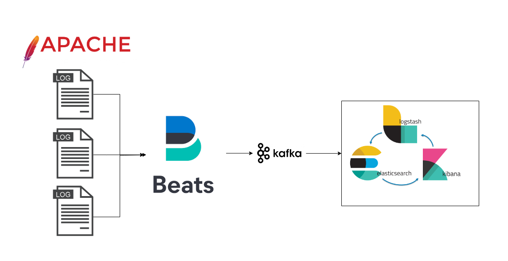

# Log-Event-Stream-Processing

## Description

Constructing a Data Flow Using the ELK Stack.

## Technologies Used :man_technologist:
- [Apache Server](https://httpd.apache.org/)
- [Filebeat](https://www.elastic.co/fr/beats/filebeat)
- [Kafka](https://kafka.apache.org/)
- [Zookeeper](https://zookeeper.apache.org/)
- [Elasticsearch](https://www.elastic.co/fr/elasticsearch)
- [Logstash](https://www.elastic.co/fr/logstash)
- [Kibana](https://www.elastic.co/fr/kibana)


## Project Architecture

<p align=center>
    
</p>

## Getting Started :airplane:

Clone this repository

```shell
# SSH
$ git clone git@github.com:fouadsafiri14/Log-Event-Stream-Processing.git

# HHTPS
$ https://github.com/fouadsafiri14/Log-Event-Stream-Processing.git
```

## Running the app :dart:

### Docker

```shell
$ docker-compose up -d
```

Visit on Kibana at [http://localhost:5601](http://localhost:5601)

## Contributing

For submitting patches and additions. Follow the **"fork-and-pull"** Git workflow.

- **Fork** the repo
- **Clone** the project to your own machine
- **Commit** changes to your own branch
- **Push** your work back up to your fork
- Submit a **Pull request** so that we can review your changes

## License